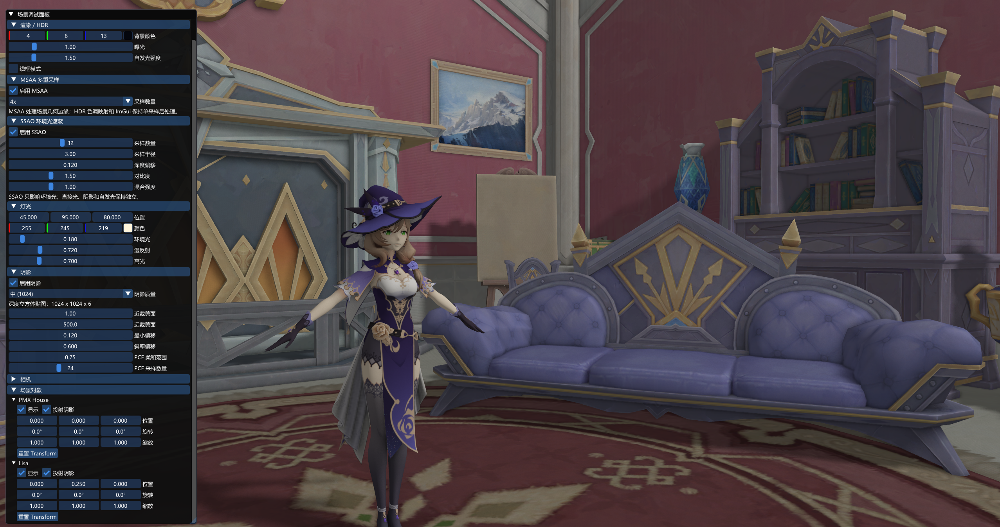
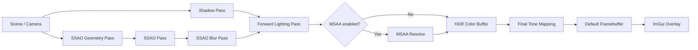
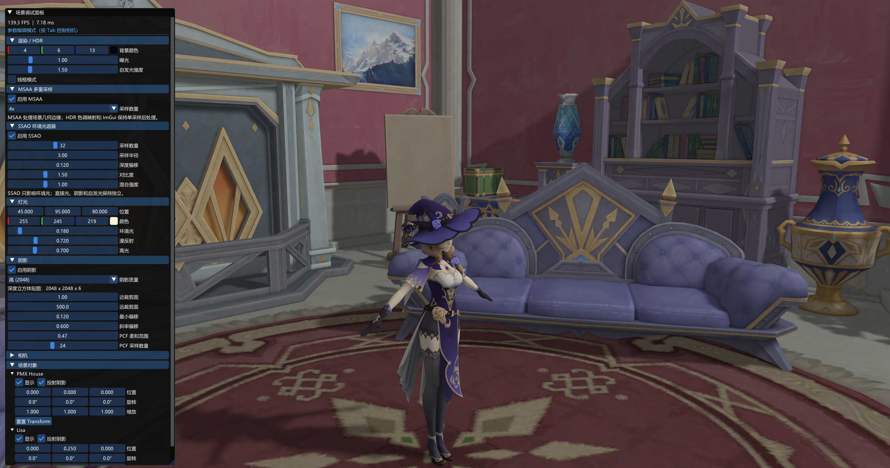
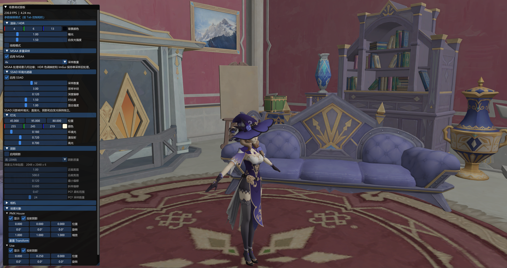
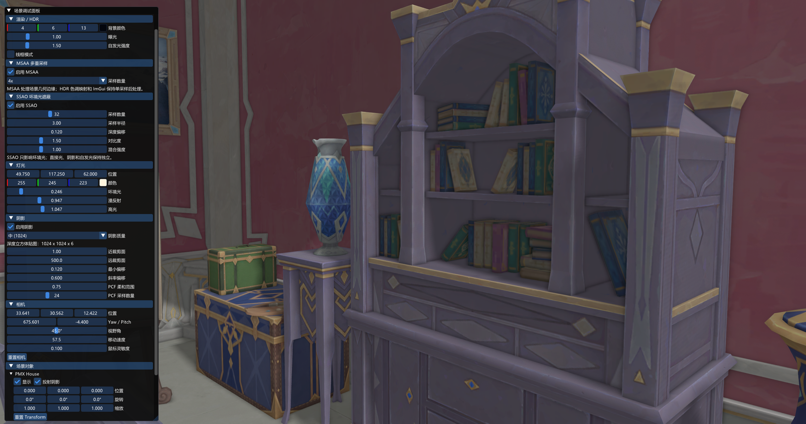
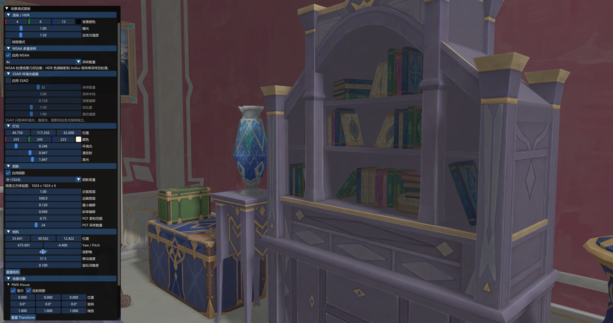

# ToyRenderer：基于 OpenGL 的实时多通道渲染器

> 一个使用 C++ 与 OpenGL 编写的学习型渲染项目。项目能够同时加载 PMX 室内场景与 OBJ 角色模型，并实现材质系统、HDR、阴影、SSAO、MSAA 以及 ImGui 实时调参。

---

## 项目展示



## 核心功能

- 支持通过 Assimp 加载 PMX 场景与 OBJ 角色模型。
- 支持 OBJ/MTL 中的 `Kd`、`Ks`、`Ns`、`Ke`、`map_Kd` 和 `map_Ke`。
- 在同一材质系统中支持经典 Blinn-Phong 与 Cook-Torrance PBR 两条光照路径。
- 支持 Diffuse、Specular、Emissive、Normal、Metallic-Roughness 和 AO 纹理。
- 使用浮点 HDR 帧缓冲保存高亮信息，并完成曝光控制、色调映射和 Gamma 校正。
- 使用深度立方体贴图实现点光源 360° 全向阴影。
- 使用硬件深度比较、无缝立方体采样与 Vogel Disk PCF 改善阴影质量。
- 使用视空间 G-Buffer、半球采样核、随机旋转噪声和模糊处理实现 SSAO。
- 支持运行时切换 2x、4x、8x MSAA，并将多采样 HDR 缓冲解析到单采样后处理缓冲。
- 使用 Dear ImGui 调整灯光、阴影、SSAO、MSAA、相机和场景物体参数。
- 将渲染流程集中到 `Renderer::Render(scene, camera, ...)`，保持主循环简洁。

## 渲染管线



每一帧由 `Renderer::Render` 统一组织。阴影和 SSAO 可按需跳过；场景几何在 Forward Pass 中完成材质计算、直接光照、阴影和环境遮蔽混合；如果开启 MSAA，则先渲染到多采样浮点帧缓冲，再解析到单采样 HDR 纹理；最后执行曝光色调映射与 Gamma 校正，并在成像结果上绘制调试界面。

---

## 1. 场景与材质系统


用 Assimp 统一解析模型文件，提取每个子网格的顶点属性（位置、法线、UV、切线等）和材质参数之后再转成自己的model，mesh类，之后再发送给GPU进行渲染。


## 2. HDR 与自发光


场景颜色首先写入 `RGBA16F` 浮点纹理，使亮度可以超过显示器直接输出的 `[0, 1]` 范围。Final Pass 使用指数色调映射：

```glsl
vec3 mappedColor = vec3(1.0) - exp(-hdrColor * exposure);
mappedColor = pow(mappedColor, vec3(1.0 / 2.2));
```

其中 `exposure` 控制整体曝光，Gamma 校正负责将线性空间结果转换到适合屏幕显示的范围。自发光颜色独立加入最终材质结果，并可在 ImGui 中统一调整自发光贴图强度。

## 3. 点光源全向阴影


<p align="center">
  
  
</p>

由于场景主光源是点光源，单张二维 Shadow Map 无法覆盖光源四周。项目为点光源生成六个方向的深度图，并保存为深度立方体贴图。Forward Pass 根据片元到光源的方向采样立方体贴图，比较当前距离与已记录的最近深度，从而判断片元是否处于阴影中。

为改善阴影摩尔纹、阴影粉刺和块状 PCF 痕迹，项目加入了以下处理：

- 使用最小 Bias 与基于法线/光照夹角的 Slope Bias。
- 使用 `samplerCubeShadow` 和 OpenGL 硬件深度比较。
- 开启 `GL_TEXTURE_CUBE_MAP_SEAMLESS`，减少立方体六个面之间的接缝。
- 使用 Vogel Disk 生成圆盘状 PCF 样本，取代规则方格采样。
- 依据世界坐标生成稳定旋转角度，弱化固定采样图案，同时避免画面随时间闪烁。
- 根据视距调整过滤范围，并限制最大角半径。

阴影贴图分辨率、远近裁剪面、Bias、PCF 柔和范围与采样数量均可在运行时修改，便于在质量、稳定性和性能之间取舍。

## 4. SSAO 环境光遮蔽


<p align="center">
  
  
</p>

SSAO 使用一个轻量的屏幕空间流程增强物体接触处和几何缝隙中的层次感：

1. Geometry Pass 将视空间位置和法线写入两个 `RGBA16F` G-Buffer 纹理。
2. SSAO Pass 在每个像素的法线半球内采样邻近位置，判断周围深度是否形成遮挡。
3. `4 × 4` 随机噪声纹理旋转采样核，避免所有像素使用完全相同的方向。
4. Blur Pass 对原始遮蔽结果进行平滑，减弱低样本数量带来的颗粒噪点。
5. Forward Pass 只将 SSAO 作用于环境光，自发光、直接光和阴影仍保持独立。

可调参数包括采样数量、采样半径、深度偏移、对比度与混合强度。用户既可以用较小半径突出模型接触阴影，也可以增大半径来加强建筑空间的整体纵深感。

## 5. MSAA 多重采样

<p align="center">
  
  
</p>

开启 MSAA 后，Forward Pass 不再直接写入普通 HDR 帧缓冲，而是写入带有多个样本的 `GL_TEXTURE_2D_MULTISAMPLE` 浮点颜色纹理和多采样深度缓冲。场景渲染结束后，通过 `glBlitFramebuffer` 将多样本颜色解析到单采样 HDR 纹理，再交给 Final Pass 处理。

这种组织方式使 2x、4x、8x MSAA 可以与 HDR 管线共存，同时避免让色调映射和 ImGui 承担不必要的多采样成本。MSAA 主要改善几何轮廓锯齿，并不能替代纹理过滤或阴影过滤。

## 6. ImGui 实时调试界面


项目使用 Dear ImGui 将影响画面的关键参数暴露出来，使渲染算法不再依赖重新编译来调节：

| 参数分组 | 可调整内容 |
| --- | --- |
| 渲染 / HDR | 背景颜色、曝光、自发光强度、线框模式 |
| MSAA | 功能开关、2x / 4x / 8x 采样数量 |
| 灯光 | 位置、颜色、环境光、漫反射和高光强度 |
| 阴影 | 开关、贴图分辨率、远近裁剪面、Bias、PCF 半径和采样数量 |
| SSAO | 开关、采样数量、半径、深度偏移、对比度和混合强度 |
| 相机 | 位置、Yaw/Pitch、视野角、移动速度和鼠标灵敏度 |
| 场景物体 | 位置、旋转、缩放、可见性、是否投射阴影和重置变换 |

按 `Tab` 可以在自由相机控制和 UI 鼠标操作之间切换，适合快速制作参数对比图与定位渲染问题。

---

## Renderer 架构

主循环只负责输入、相机、渲染调用和窗口更新，具体的帧缓冲管理与渲染 Pass 均封装在 `Renderer` 中：

```cpp
while (!windowShouldClose)
{
    UpdateInput();
    UpdateCamera();

    renderer.Render(scene, camera, framebufferWidth, framebufferHeight);
    debugUI.Draw(scene, camera, renderer);

    PresentFrame();
}
```

`Scene` 管理灯光与多个 `SceneObject`，`Model` 负责导入模型和材质，`Mesh` 负责提交网格与材质参数，`Renderer` 则只关注渲染流程。这样的职责划分减少了功能继续增加时 `main.cpp` 不断膨胀的问题，也便于单独开关和调试某一个 Pass。

## 技术栈

| 分类 | 使用技术 |
| --- | --- |
| 语言 | C++17、GLSL 330 |
| 图形 API | OpenGL 3.3 Core Profile |
| 窗口与输入 | GLFW |
| OpenGL 加载 | GLAD |
| 数学库 | GLM |
| 模型导入 | Assimp |
| 图片加载 | stb_image |
| 调试界面 | Dear ImGui |
| 构建系统 | CMake、Visual Studio 2022 |
| 模型格式 | PMX、OBJ / MTL |

## 项目结构

```text
ToyRenderer/
├─ include/                 # Renderer、Scene、Model、Mesh、Shader、Camera
├─ src/                     # 渲染流程、场景管理、调试 UI 和程序入口
├─ shaders/                 # 光照、阴影、SSAO 与 HDR Shader
├─ res/model/
│  ├─ pmxHouse/             # PMX 室内场景
│  └─ lisa/                 # OBJ 角色模型
├─ docs/images/             # 项目展示截图
├─ external/                # GLFW、GLM、stb、Assimp、Dear ImGui 子模块
├─ third_party/glad/        # OpenGL 3.3 Core 加载代码
├─ CMakeLists.txt
└─ CMakePresets.json
```

## 构建与运行

### 环境要求

- Windows 10/11
- Visual Studio 2022，并安装“使用 C++ 的桌面开发”工作负载
- CMake 3.20 或更高版本
- 支持 OpenGL 3.3 的显卡及驱动

### 获取代码

项目第三方依赖使用 Git Submodule 管理，克隆时需要递归获取：

```powershell
git clone --recurse-submodules https://github.com/Kaslana-423/ToyRenderer.git
cd ToyRenderer
```

如果已经使用普通方式克隆，可执行：

```powershell
git submodule update --init --recursive
```

### 编译运行

```powershell
cmake --preset vs2022-x64
cmake --build --preset debug
.\build\Debug\MyRenderer.exe
```

CMake 的构建后步骤会将 Shader 与当前场景资源复制到可执行文件旁，因此程序可以直接从 `build/Debug` 启动。

## 操作方式

| 按键/输入 | 功能 |
| --- | --- |
| `W` `A` `S` `D` | 前后左右移动相机 |
| 鼠标移动 | 控制观察方向 |
| 鼠标滚轮 | 调整视野范围 |
| `Tab` | 切换相机控制与 UI 操作模式 |
| `Esc` | 退出程序 |


---

> 资产说明：项目中的场景与角色资源仅用于学习和渲染效果展示，其原始版权与再分发条款归各自创作者所有。
